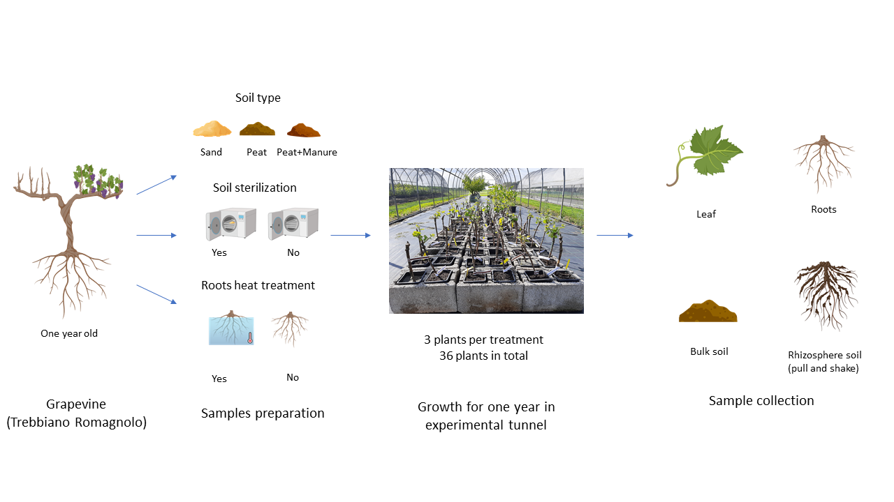

# Intevine
Here you will find data, code and information related to the project "Intevine", dedicated to the integration of several data sources to better understand grapevine biology.

This informal project is currently led by **Fabio Marroni**, with the help of many other researchers (which you will get to know in due time) and has been made possible by the collaboration between several researchers and institutions. The "lead partner" is the University of Udine, and we gratefully acknowledge help from the Institute of Applied Genomics, IGA technology services s.r.l., Vivai Cooperativi Rauscedo, and the IMEM institute of CNR in Parma. 

Currently, the PhD student **Massimo Guazzini** is actively working on the project.

The Bsc student **Laura D'Andrea** is instead no longer working on it (since she is apparently graduating!). You can find the source code for her degree disseration in the folder named [tesi_dandrea](tesi_dandrea)

Below, you can see a partial glance of our experimental set-up.

The project is work in progress, and the material contained in this page will be (slowly) updated, upon progression of the project. Stay tuned!
